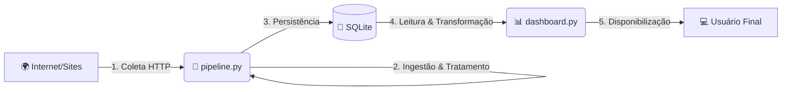

# 📡 Personal Downdetector


#### Projeto End-to-End de Engenharia de Dados
> Um monitor de disponibilidade de sites construído do zero para demonstrar o ciclo completo de dados: da coleta à visualização.

__________________________

## 🎯 Objetivo

Este projeto foi desenvolvido focando em **Engenharia de Dados**. O objetivo foi construir um **pipeline de dados** completo, funcional e desacoplado, que monitora a latência e disponibilidade de sites em tempo real.
O sistema verifica periodicamente uma lista de URLs, armazena métricas de desempenho e disponibiliza um dashboard interativo para análise de incidentes.

__________________________

## 🏗️ Arquitetura do Pipeline

O projeto segue uma arquitetura ETL (Extract, Transform, Load) simplificada, dividida em dois processos principais: o **Coletor (Backend)** e o **Visualizador (Frontend)**.



_________________________

## 🔧 As 5 Etapas da Engenharia de Dados
> Conforme os requisitos do projeto, este pipeline contempla todas as etapas fundamentais:

#### 1. 📶 Coleta (Collection)
**Fonte:** URLs externas (APIs e Websites).
- Utilização da biblioteca `requests` para enviar requisições HTTP aos sites alvo.
- Captura do `status_code` (ex: 200, 404, 500) e cálculo do tempo de resposta (latência).

#### 2. 🔄 Ingestão (Ingestion)
**Processo:** Script de automação (`pipeline.py`).
- Implementação de um loop contínuo que executa a coleta a cada 60 segundos.
- Tratamento de erros de conexão (ex: site fora do ar ou sem internet) garantindo que o pipeline não pare.

#### 3. 💾 Armazenamento (Storage)
**Destino:** Banco de Dados Relacional.
- Os dados brutos são persistidos em um banco SQLite local (`meu_monitor.db`).
- Estrutura da tabela logs: `id`, `url`, `status_code`, `tempo_resposta`, `data_hora`.

#### 4. ⚙️ Transformação (Transformation)
**Processamento:** Limpeza e enriquecimento (`pandas` e `urllib`).
- **No Pipeline:** Conversão de segundos para milissegundos (ms).
- **No Dashboard:**
  - Conversão de strings de data para objetos `datetime` do Pandas.
  - Limpeza de URLs (extração de domínios e remoção de "www") usando `urllib.parse` para melhor visualização.
  - Renomeação de colunas para apresentação (Snake Case -> Title Case).

#### 5. 📊 Disponibilização (Serving)
**Produto Final:** Dashboard Interativo.
- Construído com Streamlit.
- KPIs em Tempo Real: Cards com status (Online/Offline) e latência atual.
- Análise Histórica: Gráfico de linha interativo com filtro multiselect para comparar a performance dos sites ao longo do tempo.

_____________________________

## 💽 Como Rodar o Projeto
> Siga os passos abaixo para executar o monitor na sua máquina local.

##### Pré-requisitos
- Python 3.8 ou superior instalado.

### 1. Instalação das Dependências
> Abra o terminal na pasta do projeto e execute:

```Bash

pip install requests streamlit pandas schedule
```
-> **Nota:** O SQLite já vem nativo no Python, então normalmente não é preciso instalar nada. Contudo, caso precisar, você pode instalar manualmente o pacote sqlite3:

```bash
pip install sqlite3
```

### 2. Executando o Pipeline (Backend)
> Este script ficará rodando em segundo plano, coletando dados a cada minuto.

```Bash

python pipeline.py
```
-> Deixe este terminal aberto.

### 3. Executando o Dashboard (Frontend)
> Abra um novo terminal (mantenha o anterior rodando) e execute:

```Bash

streamlit run dashboard.py
```
-> O navegador abrirá automaticamente no endereço `http://localhost:8501`.

_____________________

## 📂 Estrutura do Projeto

```Plaintext
personal-downdetector/
│
├── meu_monitor.db       # Banco de dados (gerado automaticamente)
├── pipeline.py          # Script de Coleta e Ingestão (Backend)
├── dashboard.py         # Aplicação Streamlit (Frontend)
└── README.md            # Documentação do projeto
```

_____________________

## 📸 Screenshots

#### Visão Geral do Dashboard


#### Gráfico de Histórico


#### Tabela de Histórico 


_____________________

## 🖥️ Tecnologias Utilizadas
- **Linguagem:** Python
- **Orquestração:** Script Python (Loop/Time)
- **Banco de Dados:** SQLite3
- **Processamento de Dados:** Pandas
- **Visualização:** Streamlit

_________________________

<div align="center"> <sub>Projeto desenvolvido para fins educacionais por Rafael Bitu.</sub> </div>


